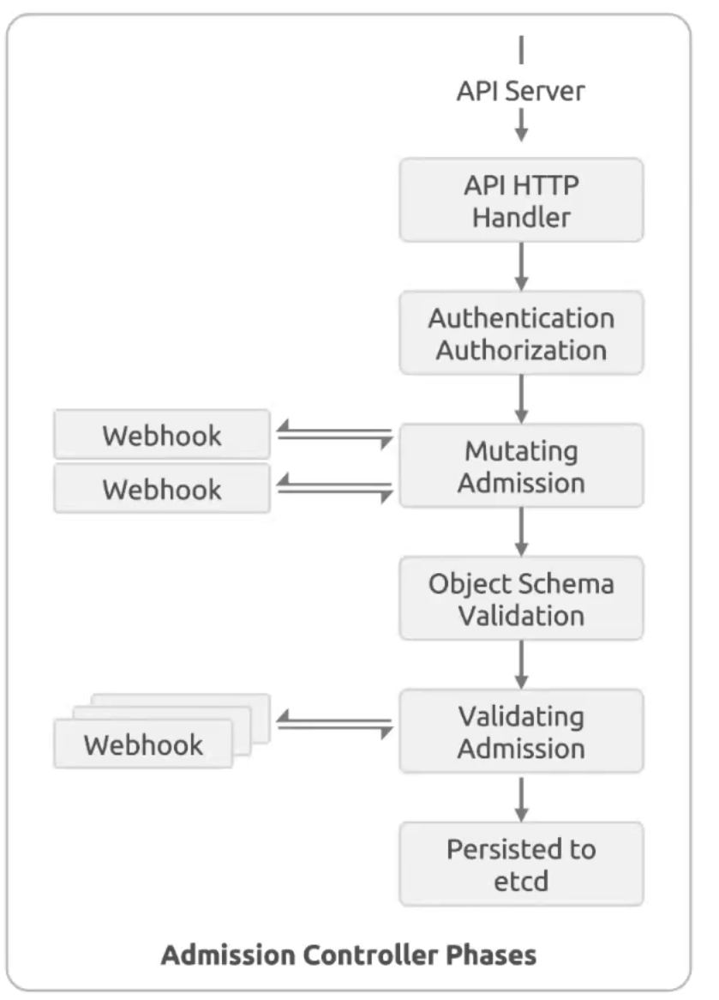
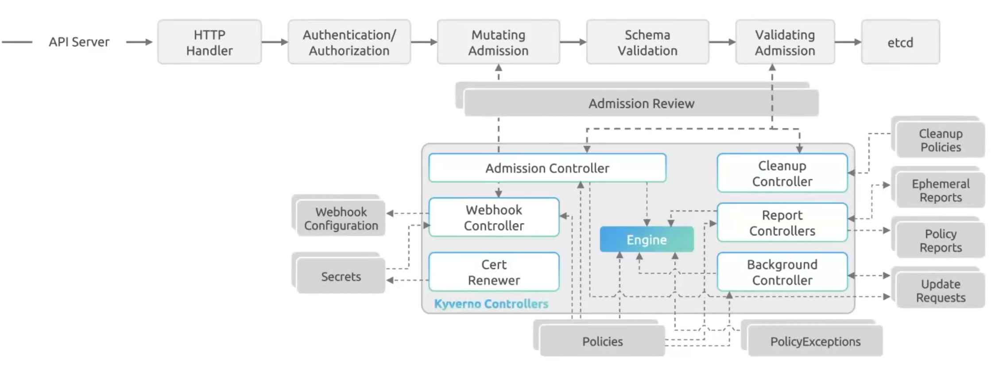

# Module 00 — Introduction & Architecture

## What is Kyverno?

Kyverno is a **Kubernetes-native policy engine** that runs as an admission controller. It uses standard Kubernetes YAML to define policies — no Rego, no new language required.

**Three core capabilities:**
- **Validate** — block or audit resources that don't meet requirements
- **Mutate** — automatically modify resources at admission time
- **Generate** — auto-create related resources when a trigger resource is created

---

## Architecture

### Phase 1 — Kubernetes Admission Controller Pipeline

Every resource request (`kubectl apply`, `kubectl create`, …) travels through a fixed pipeline inside the API server before it is written to etcd.



| Step | What happens |
|---|---|
| **API HTTP Handler** | Receives the raw HTTP request |
| **Authentication / Authorization** | Verifies who is making the request and whether they are allowed (RBAC) |
| **Mutating Admission** | Calls registered `MutatingWebhookConfiguration` webhooks — resources can be modified here. Webhooks are called and the response is merged back. |
| **Object Schema Validation** | Kubernetes validates the (now possibly mutated) object against its OpenAPI schema |
| **Validating Admission** | Calls registered `ValidatingWebhookConfiguration` webhooks — resources can be accepted or rejected here |
| **Persisted to etcd** | The final, approved object is written to the cluster store |

> **Key insight:** mutation always happens before validation. Kyverno leverages both phases — mutate rules run first, and the mutated result is what gets validated.

---

### Phase 2 — Where Kyverno Lives in the Pipeline



Kyverno registers itself as both a mutating and a validating webhook. When the API server processes a resource, it forwards an `AdmissionReview` object to Kyverno, which evaluates it against all matching policies and returns an allow/deny/patch decision.

Inside Kyverno, four specialized controllers handle different concerns:

| Controller | Responsibility |
|---|---|
| **Admission Controller** | Handles webhook callbacks for validate/mutate/generate at admission time. Contains the **Webhook Controller** (registers/updates webhook configs) and **Cert Renewer** (rotates TLS certs automatically). |
| **Background Controller** | Periodically scans existing resources against policies (background mode). Generates `Update Requests` for generate rules targeting existing resources. |
| **Cleanup Controller** | Executes `ClusterCleanupPolicy` / `CleanupPolicy` on a cron schedule to delete stale resources. |
| **Reports Controller** | Aggregates admission results and background scan outcomes into `PolicyReport` / `ClusterPolicyReport` objects. |

All controllers share a central **Engine** that evaluates policy rules. The Engine reads **Policies** and **PolicyExceptions** from the cluster and applies them to the resource under evaluation.

### Webhook Registration

Kyverno automatically creates and manages:
- `MutatingWebhookConfiguration` — for mutate rules
- `ValidatingWebhookConfiguration` — for validate rules

You never need to configure these manually. The Webhook Controller watches for new policies and updates the webhook configurations accordingly, and the Cert Renewer keeps the TLS certificates valid.

---

## The AdmissionReview Object

When a resource matching a policy's criteria hits the API server, it is wrapped in an `AdmissionReview` and sent to Kyverno:

```json
{
    "kind": "AdmissionReview",
    "apiVersion": "admission.k8s.io/v1",
    "request": {
        "uid": "3d4fc6c1-7906-47d9-b7da-fc2b22353643",
        "kind": { "group": "", "version": "v1", "kind": "Pod" },
        "operation": "CREATE",
        "userInfo": {
            "username": "thomas",
            "uid": "404d34c4-47ff-4d40-b25b-4ec4197cdf63"
        },
        "object": {
            "kind": "Pod",
            "apiVersion": "v1",
            "metadata": { "name": "mypod" },
            "spec": {
                "containers": [{ "name": "busybox", "image": "busybox" }]
            }
        },
        "oldObject": null,
        "dryRun": false
    }
}
```

Inside Kyverno policies, you access this data via **JMESPath** expressions:
- `{{ request.object.metadata.name }}` — name of the resource
- `{{ request.object.spec.containers[0].image }}` — first container image
- `{{ request.userInfo.username }}` — who made the request
- `{{ request.operation }}` — CREATE, UPDATE, or DELETE

---

## Policy Anatomy

```yaml
apiVersion: kyverno.io/v1
kind: ClusterPolicy          # or Policy (namespaced)
metadata:
  name: my-policy
  annotations:
    policies.kyverno.io/title: Human-readable title
    policies.kyverno.io/category: Best Practices
    policies.kyverno.io/severity: medium   # low / medium / high / critical
    policies.kyverno.io/description: >-
      What this policy does.
spec:
  validationFailureAction: Enforce   # Enforce | Audit
  background: true                   # enable background scanning
  admission: true                    # enable admission-time enforcement
  rules:
    - name: my-rule
      match:                         # which resources to apply to
        any:
          - resources:
              kinds:
                - Pod
      exclude:                       # resources to skip
        any:
          - resources:
              namespaces:
                - kube-system
      preconditions:                 # conditional execution
        any:
          - key: "{{ request.operation }}"
            operator: Equals
            value: CREATE
      validate:                      # or mutate / generate / verifyImages
        message: "Error message shown on failure"
        pattern:
          metadata:
            labels:
              app: "?*"
```

---

## Match & Exclude

The `match` and `exclude` blocks use the same structure. A resource must satisfy `match` **and** must NOT satisfy `exclude`.

```yaml
match:
  any:   # OR logic — resource matches if any entry is true
    - resources:
        kinds: [Pod]
        namespaces: [production]
    - resources:
        kinds: [Pod]
        selector:
          matchLabels:
            critical: "true"

  all:   # AND logic — resource must match ALL entries
    - resources:
        kinds: [Pod]
    - resources:
        selector:
          matchLabels:
            app: critical
```

**Available filters:**
| Field | Description |
|---|---|
| `kinds` | Resource types (Pod, Deployment, Namespace, ...) |
| `namespaces` | Namespace names |
| `names` | Resource names (supports wildcards: `app-*`) |
| `selector` | Label selector |
| `annotations` | Annotation-based matching |

---

## Preconditions

Preconditions act as an `if` statement. The rule only executes when ALL/ANY preconditions pass.

```yaml
preconditions:
  any:
    - key: "{{ request.object.metadata.labels.color || '' }}"
      operator: Equals
      value: blue
    - key: "{{ request.object.metadata.labels.app || '' }}"
      operator: Equals
      value: busybox
```

**Available operators:** `Equals`, `NotEquals`, `In`, `NotIn`, `AnyIn`, `AllIn`, `AnyNotIn`, `AllNotIn`, `GreaterThan`, `GreaterThanOrEquals`, `LessThan`, `LessThanOrEquals`, `DurationGreaterThan`, `PatternMatch`

---

## Policy Scopes

| Resource | Scope | When to use |
|---|---|---|
| `ClusterPolicy` | Cluster-wide | Applies to all namespaces |
| `Policy` | Namespaced | Applies only within a specific namespace |

---

## Next Steps

→ [Module 01 — Installation](../01-installation/README.md)
